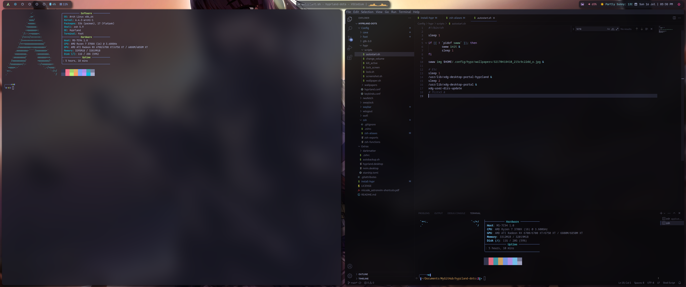

# Dotfiles

This repository contains my personal configuration files for my hyprland setup.

# Screenshots



# Installation

It is highly recommended only to use this script with a new installation of Arch Linux.

```shell
git clone https://github.com/bknightinfo/hyprland-dots
cd hyprland-dots
./install-hypr
```

## Notes:

I used mrbman repository (https://github.com/mrbman/hyprland-dotfiles) as a base to start my hyprland my journey plus I also acknowledge soldoestech (https://github.com/SolDoesTech) for inspiration for the installer.   
